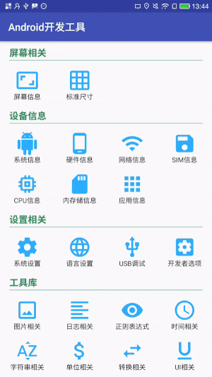

# AndroidTools

[English README](https://github.com/mazouri/AndroidTools/blob/master/README.md)

## 关于AndroidTools

这个项目包含了我们Android开发中常用的工具类。集成这个项目后，我们自己就不用写各种Utils类了，这将会简化你的代码，节省开发者的宝贵时间，让我们把注意力转到最重要的业务上来，使我们的开发变得更容易。Happy coding!

## 如何使用AndroidTools

### 1.在根目录的build.gradle文件中repositories的末尾添加如下：

    allprojects {
		  repositories {
			  ...
			  maven { url 'https://jitpack.io' }
		  }
	  }
    
### 2.在你的app/build.gradle文件中添加依赖：

    dependencies {
	        compile 'com.github.mazouri:AndroidTools:1.0'
	  }
    
### 3.在你的application类中初始化AndroidTools:

    public class YourApplication extends Application {

      @Override
      public void onCreate() {
          super.onCreate();

	        //必须调用init方法
          Tools.init(this); 
          
          //可选 如果你想看到AndroidTools内部打印的log,　要加上这一行
          Tools.openToolsLog(true); 
      }
    }
    

### 4.然后你可以像下面这样使用【Tools.工具类型.具体方法】:

    // 日志工具，此方法为指定tag打印log
    Tools.log().tag(App.class.getSimpleName()).d("print log with tag()"); 
    
    // 字符串工具，此方法为 判断字符串是否为空
    Tools.string().isEmpty(App.class.getSimpleName()); 
    
    // 网络工具类，此方法为　判断是否连接wifi
    Tools.network().isWifiConnected(this);  
    
## Screenshots

## 归类总结，方便大家查阅

**你也可以通过**docs**进行查阅**.

### Tools

<table>
<tr>
    <th>Tools.app()</th>
    <th>获取Application, 即Context</th>
</tr>
</table>

All tools list: AppTool, ApkTool, InputMethodTool, IntentTool, ProcessTool, SnackbarTool, ToastTool, ConstantsTool, ConvertTool, DeviceTool, NetworkTool, BitmapTool, CloseTool, ExternalStorageTool, FileTool, SPTool, LogTool, RegexTool, SecureTool, ShellTool, StringTool, TimeTool, UnitTool.

### AppTool
    //usage examples:
    Tools.appTool().getAllRunningService(Tools.app()); //获取所有运行的服务
        Tools.appTool().startService(Tools.app(), MockService.class); //启动服务

<table>
    <tr>
        <th>getAllRunningService</th>
        <th>获取所有运行的服务</th>
    </tr>
    <tr>
        <th>startService</th>
        <th>启动服务</th>
    </tr>
    <tr>
        <th>stopService</th>
        <th>停止服务</th>
    </tr>
    <tr>
        <th>bindService</th>
        <th>绑定服务</th>
    </tr>
        <tr>
        <th>unbindService</th>
        <th>解绑服务</th>
    </tr>
    <tr>
        <th>getAppVersionCode</th>
        <th>获取应用版本号</th>
    </tr>
    <tr>
        <th>getLauncherActivity</th>
        <th>获取launcher activity</th>
    </tr>
    <tr>
        <th>getPackageName</th>
        <th>获取应用包名</th>
    </tr>
    <tr>
        <th>getTopActivityName</th>
        <th>获取顶层activity名称</th>
    </tr>
    <tr>
        <th>getVersionNameFromPackage</th>
        <th>获取应用版本名称</th>
    </tr>
    <tr>
        <th>isActivityExists</th>
        <th>判断是否存在Activity</th>
    </tr>
    <tr>
        <th>isAppForeground</th>
        <th>判断App是否处于前台</th>
    </tr>
    <tr>
        <th>isProessRunning</th>
        <th>进程是否运行</th>
    </tr>
    <tr>
        <th>isProessRunning</th>
        <th>进程是否运行</th>
    </tr>
    <tr>
        <th>isRunningForeground</th>
        <th>判断应用是否在前台运行</th>
    </tr>
    <tr>
        <th>isServiceRunning</th>
        <th>服务是否运行</th>
    </tr>
    <tr>
        <th>launchActivity</th>
        <th>打开Activity</th>
    </tr>
    
</table>

### ApkTool
    //usage examples:
    Tools.apk().getAppDetailsSettings(Tools.app()); // 获取App具体设置

<table>
    <tr>
        <th>getAppDetailsSettings</th>
        <th>获取App具体设置</th>
    </tr>
        <tr>
        <th>getAppIcon</th>
        <th>获取App图标</th>
    </tr>
        <tr>
        <th>getAppName</th>
        <th>获取App名称</th>
    </tr>
        <tr>
        <th>getAppPath</th>
        <th>获取App路径</th>
    </tr>
        <tr>
        <th>getAppSignature</th>
        <th>获取App签名</th>
    </tr>
        <tr>
        <th>getAppSignatureSHA1</th>
        <th>获取应用签名的的SHA1值</th>
    </tr>
        <tr>
        <th>getChannelFromApk</th>
        <th>从apk中获取版本信息</th>
    </tr>
        <tr>
        <th>installApp</th>
        <th>安装App</th>
    </tr>
        <tr>
        <th>installAppSilent</th>
        <th>静默安装App</th>
    </tr>
        <tr>
        <th>uninstallAppSilent</th>
        <th>静默卸载App</th>
    </tr>

        <tr>
        <th>isAppDebug</th>
        <th>判断App是否是Debug版本</th>
    </tr>

        <tr>
        <th>isAppInstall</th>
        <th>检查手机上是否安装了指定的软件</th>
    </tr>

        <tr>
        <th>isAppRoot</th>
        <th>判断App是否有root权限</th>
    </tr>

        <tr>
        <th>isSystemApp</th>
        <th>判断App是否是系统应用</th>
    </tr>
  
        <tr>
        <th>launchApp</th>
        <th>打开App</th>
    </tr>
 
        <tr>
        <th>uninstallApp</th>
        <th>卸载App</th>
    </tr>

</table>

### InputMethodTool
    //usage examples:
    Tools.inputMethod().isActiveSoftInput(Tools.app()); // 判断输入法是否处于激活状态
    
<table>
    <tr>
        <th>hideInputSoftFromWindowMethod</th>
        <th>隐藏键盘 ：强制隐藏</th>
    </tr>
    <tr>
        <th>isActiveSoftInput</th>
        <th>判断输入负是否处于激活状态</th>
    </tr>
    <tr>
        <th>showInputSoftFromWindowMethod</th>
        <th>显示输入法</th>
    </tr>
</table>

### ProcessTool
    //usage examples:
    Tools.process().getAllBackgroundProcesses(); // 获取后台服务进程
    
<table>
    <tr>
        <th>getAllBackgroundProcesses</th>
        <th>获取所有的后台服务进程</th>
    </tr>
    <tr>
        <th>getForegroundProcessName</th>
        <th>获取前台线程包名</th>
    </tr>
    <tr>
        <th>killAllBackgroundProcesses</th>
        <th>杀死所有的后台服务进程</th>
    </tr>
    <tr>
        <th>killBackgroundProcesses</th>
        <th>杀死后台服务进程</th>
    </tr>
</table>

### IntentTool
    //usage examples:
    Tools.intent().getInstallAppIntent("/sdcard/mock.apk"); // 获取安装App的意图
    
<table>
    <tr>
        <th>getAppDetailsSettingsIntent</th>
        <th>获取App具体设置的意图</th>
    </tr>
    <tr>
        <th>getCaptureIntent</th>
        <th>获取拍照的意图</th>
    </tr>
    <tr>
        <th>getComponentIntent</th>
        <th>获取其他应用组件的意图</th>
    </tr>
    <tr>
        <th>getInstallAppIntent</th>
        <th>获取安装App的意图</th>
    </tr>
    <tr>
        <th>getLaunchAppIntent</th>
        <th>获取打开App的意图</th>
    </tr>
    <tr>
        <th>getShareImageIntent</th>
        <th>获取分享图片的意图</th>
    </tr>
    <tr>
        <th>getShareTextIntent</th>
        <th>获取分享文本的意图</th>
    </tr>
    <tr>
        <th>getShutdownIntent</th>
        <th>获取分享文本的意图</th>
    </tr>
    <tr>
        <th>getUninstallAppIntent</th>
        <th>获取分享文本的意图</th>
    </tr>
</table>

### SnackbarTool
    //usage examples:
    Tools.snackbar().dismissSnackbar()(); // 取消snackbar显示
    
<table>
    <tr>
        <th>addView</th>
        <th>为snackbar添加布局 在show...Snackbar之后调用</th>
    </tr>
     <tr>
        <th>dismissSnackbar</th>
        <th>取消snackbar显示</th>
    </tr>
     <tr>
        <th>showIndefiniteSnackbar</th>
        <th>显示自定义时长snackbar</th>
    </tr>
     <tr>
        <th>showLongSnackbar</th>
        <th>显示长时snackbar</th>
    </tr>
    <tr>
        <th>showShortSnackbar</th>
        <th>显示短时snackbar</th>
    </tr>

</table>

### ProcessTool
    //usage examples:
    Tools.process().getAllBackgroundProcesses(); // 获取后台服务进程
    
<table>
    <tr>
        <th>getAllBackgroundProcesses</th>
        <th>获取后台服务进程</th>
    </tr>
</table>

### ToastTool
    //usage examples:
    Tools.toast().showToast(Toast.app, "show toast"); // 获取后台服务进程
    
<table>
    <tr>
        <th>showToast</th>
        <th>显示Short型Toast</th>
    </tr>
    <tr>
        <th>showToastLong</th>
        <th>显示Long型Toast</th>
    </tr>
</table>

### ConvertTool
    //usage examples:
    Tools.convert().dp2px(50f); // dp转px
    
<table>
    <tr>
        <th>bitmap2Bytes</th>
        <th>bitmap转byteArr</th>
    </tr>
    <tr>
        <th>bitmap2Drawable</th>
        <th>bitmap转drawable</th>
    </tr>
    <tr>
        <th>bits2Bytes</th>
        <th>bits转bytes</th>
    </tr>
    <tr>
        <th>byte2FitMemorySize</th>
        <th>字节数转合适内存大小 保留3位小数</th>
    </tr>
    <tr>
        <th>byte2MemorySize</th>
        <th>字节数转以unit为单位的内存大小</th>
    </tr>
    <tr>
        <th>bytes2Bitmap</th>
        <th>byteArr转bitmap</th>
    </tr>
    <tr>
        <th>bytes2Bits</th>
        <th>bytes转bits</th>
    </tr>
    <tr>
        <th>bytes2Chars</th>
        <th>byteArr转charArr</th>
    </tr>
    <tr>
        <th>bytes2Drawable</th>
        <th>byteArr转drawable</th>
    </tr>
    <tr>
        <th>bytes2HexString</th>
        <th>byteArr转hexString</th>
    </tr>
    <tr>
        <th>bytes2InputStream</th>
        <th>byteArr转inputStream</th>
    </tr>
    <tr>
        <th>bytes2OutputStream</th>
        <th>outputStream转byteArr</th>
    </tr>
    <tr>
        <th>dp2px</th>
        <th>dp转px</th>
    </tr>
    <tr>
        <th>px2dp</th>
        <th>px转dp</th>
    </tr>
    <tr>
        <th>px2sp</th>
        <th>px转sp</th>
    </tr>
    <tr>
        <th>sp2px</th>
        <th>sp转px</th>
    </tr>
    <tr>
        <th>drawable2Bitmap</th>
        <th>drawable转bitmap</th>
    </tr>
    <tr>
        <th>drawable2Bytes</th>
        <th>drawable转byteArr</th>
    </tr>
    <tr>
        <th>hexString2Bytes</th>
        <th>hexString转byteArr</th>
    </tr>
    <tr>
        <th>input2OutputStream</th>
        <th>inputStream转outputStream</th>
    </tr>
    <tr>
        <th>inputStream2Bytes</th>
        <th>inputStream转byteArr</th>
    </tr>
    <tr>
        <th>inputStream2String</th>
        <th>inputStream转string按编码</th>
    </tr>
    <tr>
        <th>memorySize2Byte</th>
        <th>以unit为单位的内存大小转字节数</th>
    </tr>
    <tr>
        <th>millis2FitTimeSpan</th>
        <th>毫秒时间戳转合适时间长度</th>
    </tr>
    <tr>
        <th>millis2TimeSpan</th>
        <th>毫秒时间戳转以unit为单位的时间长度</th>
    </tr>
    <tr>
        <th>output2InputStream</th>
        <th>outputStream转inputStream</th>
    </tr>
    <tr>
        <th>outputStream2Bytes</th>
        <th>outputStream转byteArr</th>
    </tr>
    <tr>
        <th>outputStream2String</th>
        <th>outputStream转string按编码</th>
    </tr>
    <tr>
        <th>string2InputStream</th>
        <th>string转inputStream按编码</th>
    </tr>
    <tr>
        <th>string2OutputStream</th>
        <th>string转outputStream按编码</th>
    </tr>
    <tr>
        <th>timeSpan2Millis</th>
        <th>以unit为单位的时间长度转毫秒时间戳</th>
    </tr>
    <tr>
        <th>view2Bitmap</th>
        <th>view转Bitmap</th>
    </tr>

</table>

### DeviceTool
    //usage examples:
    Tools.device().getAllSDCardSize(); // 获取SD大小
    
<table>
    <tr>
        <th>coptyToClipBoard</th>
        <th>复制到剪切板</th>
    </tr>
     <tr>
        <th>existSDCard</th>
        <th>判断SDCard是否可用</th>
    </tr>
     <tr>
        <th>getAllSDCardSize</th>
        <th>获取SD大小</th>
    </tr>
     <tr>
        <th>getAppPackageNamelist</th>
        <th>获取非系统应用包名</th>
    </tr>
     <tr>
        <th>getAvailaleSDCardSize</th>
        <th>获取可用空间大小</th>
    </tr>
        <tr>
        <th>getIMEI</th>
        <th>获取IMEI</th>
    </tr>
     <tr>
        <th>getLatestCameraPicture</th>
        <th>获取最后一次拍照的图片</th>
    </tr>
     <tr>
        <th>getLocalIPAddress</th>
        <th>获取本机IP地址</th>
    </tr>
     <tr>
        <th>getMac</th>
        <th>获取MAC地址</th>
    </tr>
     <tr>
        <th>getNavigationBarHeight</th>
        <th>获取navigationbar高度</th>
    </tr>
        <tr>
        <th>getScreenPix</th>
        <th>获取手机大小（分辨率）</th>
    </tr>
     <tr>
        <th>getStatusBarHeight</th>
        <th>获取statusbar高度</th>
    </tr>
     <tr>
        <th>getTopBarHeight</th>
        <th>获取状态栏高度＋标题栏(ActionBar)高度</th>
    </tr>
     <tr>
        <th>getUDID</th>
        <th>获取UDID</th>
    </tr>
     <tr>
        <th>goHome</th>
        <th>主动回到Home，后台运行</th>
    </tr>
         <tr>
        <th>isOnline</th>
        <th>是否有网络</th>
    </tr>
         <tr>
        <th>isSoftKeyAvail</th>
        <th>判断是否有软控制键</th>
    </tr>
             <tr>
        <th>isSoftKeyAvail</th>
        <th>判断是否有软控制键</th>
    </tr>
         <tr>
        <th>vibrate</th>
        <th>震动</th>
    </tr>
</table>

### NetworkTool
    //usage examples:
    Tools.network().getDataEnabled()(); // 判断移动数据是否打开
    
<table>
    <tr>
        <th>getDataEnabled</th>
        <th>判断移动数据是否打开</th>
    </tr>
     <tr>
        <th>getDomainAddress</th>
        <th>获取域名ip地址 </th>
    </tr>
     <tr>
        <th>getIPAddress</th>
        <th>获取IP地址</th>
    </tr>
     <tr>
        <th>getNetType</th>
        <th>判断手机连接的网络类型(wifi,2G,3G,4G)</th>
    </tr>
        <tr>
        <th>getNetworkOperatorName</th>
        <th>获取网络运营商名称 如中国移动、中国联通、中国电信</th>
    </tr>
     <tr>
        <th>is4G()</th>
        <th>判断网络是否是4G</th>
    </tr>
     <tr>
        <th>isNetworkConnected</th>
        <th>判断是否连接网络</th>
    </tr>
     <tr>
        <th>isWifiConnected</th>
        <th>判断是否连接wifi</th>
    </tr>
        <tr>
        <th>openWirelessSettings</th>
        <th>打开网络设置界面 3.0以下打开设置界面</th>
    </tr>
     <tr>
        <th>setDataEnabled</th>
        <th>打开或关闭移动数据</th>
    </tr>

</table>

### BitmapTool
    //usage examples:
    Tools.bitmap().toRoundCorner(); // 转化成圆bitmap
    
<table>
    <tr>
        <th>bitmapToByte</th>
        <th>Bitmap转bytes</th>
    </tr>
        <tr>
        <th>bitmapToDrawable</th>
        <th>Bitmap转Drawable</th>
    </tr>
        <tr>
        <th>bitmapToString</th>
        <th>bitmap转换成Base64编码String</th>
    </tr>
        <tr>
        <th>byteToBitmap</th>
        <th>bytes转Bitmap</th>
    </tr>
        <tr>
        <th>compressBimap</th>
        <th>质量压缩图片-压缩在maxSize以内</th>
    </tr>
        <tr>
        <th>compressBitmap</th>
        <th>等比压缩（宽高等比缩放）</th>
    </tr>
        <tr>
        <th>compressBitmap</th>
        <th>压缩bitmp到目标大小（质量压缩）</th>
    </tr>
        <tr>
        <th>compressBitmap</th>
        <th>质量压缩图片-压缩在1M以内</th>
    </tr>
        <tr>
        <th>compressBitmap</th>
        <th>质量压缩图片</th>
    </tr>
        <tr>
        <th>compressBitmap</th>
        <th>图片缩放-尺寸缩放</th>
    </tr>
        <tr>
        <th>compressBitmapBig</th>
        <th>图片缩放-尺寸缩放</th>
    </tr>
        <tr>
        <th>compressBitmapSmall</th>
        <th>图片缩放-尺寸缩放</th>
    </tr>
        <tr>
        <th>compressImage</th>
        <th>质量压缩图片-压缩在1M以内</th>
    </tr>
        <tr>
        <th>compressImage</th>
        <th>质量压缩图片</th>
    </tr>
        <tr>
        <th>compressImage</th>
        <th>质量压缩图片-压缩在maxSize以内</th>
    </tr>
            <tr>
        <th>createBitmapThumbnail</th>
        <th>生成bitmap缩略图</th>
    </tr>
            <tr>
        <th>drawableToBitmap</th>
        <th>drawable转Bitmap</th>
    </tr>
            <tr>
        <th>getDegress</th>
        <th>根据path, 获取图片旋转角度</th>
    </tr>
            <tr>
        <th>rotateBitmap</th>
        <th>旋转bitmap</th>
    </tr>
                <tr>
        <th>saveBitmap</th>
        <th>保存Bitmap到文件</th>
    </tr>
                <tr>
        <th>scaleImage</th>
        <th>缩放image</th>
    </tr>
                <tr>
        <th>scaleImageTo</th>
        <th>缩放image到指定高、宽</th>
    </tr>
    
</table>

### CloseTool
    //usage examples:
    Tools.close().closeIO(in); // 关闭IO
    
<table>
    <tr>
        <th>closeIO</th>
        <th>关闭IO</th>
    </tr>
        <tr>
        <th>closeIOQuietly</th>
        <th>安静关闭IO</th>
    </tr>

</table>

### ExternalStorageTool
    //usage examples:
    Tools.externalStorage().isAvailable(); // sdcard是否可用
    
<table>
    <tr>
        <th>getAllStorageLocations</th>
        <th>获取所有可用sdcard</th>
    </tr>
        <tr>
        <th>getSdCardPath</th>
        <th>获取sdcard路径</th>
    </tr>
        <tr>
        <th>isAvailable</th>
        <th>sdcard是否可用</th>
    </tr>
    <tr>
        <th>isWritable</th>
        <th>sdcard是否可写</th>
    </tr>
</table>

### FileTool
    //usage examples:
    Tools.file().getFileByPath("/sdcard/mock.txt"); // 根据文件路径获取文件
    
<table>
    <tr>
        <th>copyDir</th>
        <th>复制目录</th>
    </tr>
    <tr>
        <th>copyFile</th>
        <th>复制文件</th>
    </tr>
    <tr>
        <th>createFileByDeleteOldFile</th>
        <th>判断文件是否存在，存在则在创建之前删除</th>
    </tr>
    <tr>
        <th>createOrExistsDir</th>
        <th>判断目录是否存在，不存在则判断是否创建成功</th>
    </tr>
    <tr>
        <th>createOrExistsFile</th>
        <th>判断文件是否存在，不存在则判断是否创建成功</th>
    </tr>
    <tr>
        <th>deleteDir</th>
        <th>删除目录</th>
    </tr>
    <tr>
        <th>deleteFile</th>
        <th>删除文件</th>
    </tr>
    <tr>
        <th>deleteFilesInDir</th>
        <th>删除目录下的所有文件</th>
    </tr>
    <tr>
        <th>getDirLength</th>
        <th>获取目录长度</th>
    </tr>
    <tr>
        <th>getDirName</th>
        <th>获取全路径中的最长目录</th>
    </tr>
    <tr>
        <th>getFileByPath</th>
        <th>根据文件路径获取文件</th>
    </tr>
    <tr>
        <th>getFileCharsetSimple</th>
        <th>简单获取文件编码格式</th>
    </tr>
    <tr>
        <th>getFileExtension</th>
        <th>获取全路径中的文件拓展名</th>
    </tr>
    <tr>
        <th>getFileLastModified</th>
        <th>获取文件最后修改的毫秒时间戳</th>
    </tr>
    <tr>
        <th>getFileLength</th>
        <th>获取文件长度</th>
    </tr>
    <tr>
        <th>getFileLines</th>
        <th>获取文件行数</th>
    </tr>
    <tr>
        <th>getFileMD5</th>
        <th>获取文件的MD5校验码</th>
    </tr>
    <tr>
        <th>getFileMD5ToString</th>
        <th>获取文件的MD5校验码</th>
    </tr>
    <tr>
        <th>getFileName</th>
        <th>获取全路径中的文件名</th>
    </tr>
    <tr>
        <th>getFileNameNoExtension</th>
        <th>获取全路径中的不带拓展名的文件名</th>
    </tr>
    <tr>
        <th>getFileSize</th>
        <th>获取文件大小</th>
    </tr>
    <tr>
        <th>isDir</th>
        <th>判断是否是目录</th>
    </tr>
    <tr>
        <th>isFile</th>
        <th>判断是否是文件</th>
    </tr>
    <tr>
        <th>isFileExists</th>
        <th>判断文件是否存在</th>
    </tr>
    <tr>
        <th>listFilesInDir</th>
        <th>获取目录下所有文件包括子目录</th>
    </tr>
    <tr>
        <th>listFilesInDirWithFilter</th>
        <th>获取目录下所有符合filter的文件包括子目录</th>
    </tr>
    <tr>
        <th>moveDir</th>
        <th>移动目录</th>
    </tr>
    <tr>
        <th>moveFile</th>
        <th>移动文件</th>
    </tr>
    <tr>
        <th>readFile2Bytes</th>
        <th>读取文件到字符数组中</th>
    </tr>
    <tr>
        <th>readFile2List</th>
        <th>指定编码按行读取文件到链表中</th>
    </tr>
    <tr>
        <th>readFile2String</th>
        <th>指定编码按行读取文件到字符串中</th>
    </tr>
    <tr>
        <th>rename</th>
        <th>重命名文件</th>
    </tr>
    <tr>
        <th>searchFileInDir</th>
        <th>获取目录下指定文件名的文件包括子目录 大小写忽略</th>
    </tr>
    <tr>
        <th>writeFileFromIS</th>
        <th>将输入流写入文件</th>
    </tr>
    <tr>
        <th>writeFileFromString</th>
        <th>将字符串写入文件</th>
    </tr>
</table>

### SPTool
    //usage examples:
    Tools.sp().saveShareBoolean("mock_key", true); // 存储moke_key的值到shared_preference的文件
    
<table>
    <tr>
        <th>name</th>
        <th>设置SharedPreference的xml文件名，默认为AndroidTools.xml</th>
    </tr>
    <tr>
        <th>saveShareBoolean</th>
        <th>存储布尔值</th>
    </tr>
    <tr>
        <th>saveShareInt</th>
        <th>存储整型值</th>
    </tr>
    <tr>
        <th>saveShareString</th>
        <th>存储字符串</th>
    </tr>
</table>

### LogTool
    //three kinds of LogTool usage:
    Tools.log().d("print log with default generated tag"); //默认tag ==> 打印结果为【类名.方法名[第几行]】:App.onCreate(line:20)
    Tools.log().tag(App.class.getSimpleName()).d("print log with tag()");//指定tag
    Tools.log().d(App.class.getSimpleName(), "print log with set tag");//指定tag
    
<table>
    <tr>
        <th>setDebug</th>
        <th>设置是否打印log</th>
    </tr>
    <tr>
        <th>tag</th>
        <th>设置tag</th>
    </tr>
</table>

### RegexTool
    //usage examples:
    Tools.regex().isEmail("wangdd_bj@163.com"); // 获取后台服务进程
    
<table>
    <tr>
        <th>isUserName</th>
        <th>是否为用户名</th>
    </tr>
     <tr>
        <th>isPassword</th>
        <th>是否为密码</th>
    </tr>
     <tr>
        <th>isMobile</th>
        <th>是否为手机号</th>
    </tr>
     <tr>
        <th>isEmail</th>
        <th>是否为邮箱</th>
    </tr>
     <tr>
        <th>isChinese</th>
        <th>是否为中文</th>
    </tr>
     <tr>
        <th>isIDCard</th>
        <th>是否为身份证号（中国）</th>
    </tr>
     <tr>
        <th>isUrl</th>
        <th>是否为URL</th>
    </tr>
    <tr>
        <th>isIPAddress</th>
        <th>是否为IP地址</th>
    </tr>
    <tr>
        <th>isPlateNum</th>
        <th>是否为车牌号（中国）</th>
    </tr>
    <tr>
        <th>isVehicleVin</th>
        <th>是否为车辆vin码</th>
    </tr>
</table>

### ShellTool
    //usage examples:
    Tools.shell().execCmd("ls /sdcard/", ""); // 获取后台服务进程
    
<table>
    <tr>
        <th>execCmd</th>
        <th>是否是在root下执行命令</th>
    </tr>
</table>

### StringTool
    //usage examples:
    Tools.string().isEmpty(); // 是否为null或者长度为0或者都是空格
<table>
    <tr>
        <th>isEmpty</th>
        <th>是否为null或者长度为0或者都是空格</th>
    </tr>
    <tr>
        <th>isBlank</th>
        <th>是否为null或者长度为0或者都是空格</th>
    </tr>
    <tr>
        <th>length</th>
        <th>字符串长度，如果为null，返回0</th>
    </tr>
    <tr>
        <th>nullStrToEmpty</th>
        <th>将空对象转化为空字符串</th>
    </tr>
    <tr>
        <th>capitalizeFirstLetter</th>
        <th>首字母大写</th>
    </tr>
    <tr>
        <th>utf8Encode</th>
        <th>编码为utf-8</th>
    </tr>
    <tr>
        <th>fullWidthToHalfWidth</th>
        <th>全角转半角</th>
    </tr>
    <tr>
        <th>halfWidthToFullWidth</th>
        <th>半角转全角</th>
    </tr>
    <tr>
        <th>sqliteEscape</th>
        <th>数据库字符转义</th>
    </tr>

</table>

### TimeTool
    //usage examples:
    Tools.time().millis2String(System.currentTimeMillis()); // 将时间戳转为时间字符串
    
<table>
    <tr>
        <th>date2Millis</th>
        <th>将Date类型转为时间戳</th>
    </tr>
    <tr>
        <th>date2String</th>
        <th>将Date类型转为时间字符串</th>
    </tr>
    <tr>
        <th>getChineseZodiac</th>
        <th>获取生肖</th>
    </tr>
    <tr>
        <th>getFitTimeSpan</th>
        <th>获取合适型两个时间差</th>
    </tr>
    <tr>
        <th>getFitTimeSpanByNow</th>
        <th>获取合适型与当前时间的差</th>
    </tr>
    <tr>
        <th>getFriendlyTimeSpanByNow</th>
        <th>获取友好型与当前时间的差</th>
    </tr>
    <tr>
        <th>getNowTimeDate</th>
        <th>获取当前Date</th>
    </tr>
    <tr>
        <th>getNowTimeMills</th>
        <th>获取当前毫秒时间戳</th>
    </tr>
    <tr>
        <th>getNowTimeString</th>
        <th>获取当前时间字符串</th>
    </tr>
    <tr>
        <th>getTimeSpan</th>
        <th>获取两个时间差</th>
    </tr>
    <tr>
        <th>getTimeSpanByNow</th>
        <th>获取与当前时间的差</th>
    </tr>
    <tr>
        <th>getWeek</th>
        <th>获取星期</th>
    </tr>
    <tr>
        <th>getWeekIndex</th>
        <th>获取星期 注意：周日的Index才是1，周六为7</th>
    </tr>
    <tr>
        <th>getWeekOfMonth</th>
        <th>获取月份中的第几周 注意：国外周日才是新的一周的开始</th>
    </tr>
    <tr>
        <th>getWeekOfYear</th>
        <th>获取年份中的第几周 注意：国外周日才是新的一周的开始</th>
    </tr>
    <tr>
        <th>getZodiac</th>
        <th>获取星座</th>
    </tr>
    <tr>
        <th>isLeapYear</th>
        <th>判断是否闰年</th>
    </tr>
    <tr>
        <th>isSameDay</th>
        <th>判断是否同一天</th>
    </tr>
    <tr>
        <th>millis2Date</th>
        <th>将时间戳转为Date类型</th>
    </tr>
    <tr>
        <th>millis2String</th>
        <th>将时间戳转为时间字符串</th>
    </tr>
    <tr>
        <th>string2Date</th>
        <th>将时间字符串转为Date类型</th>
    </tr>
    <tr>
        <th>string2Millis</th>
        <th>将时间字符串转为时间戳</th>
    </tr>
    
</table>

### UnitTool
    //usage examples:
    Tools.unit().c2f(27f); // 摄氏度转华氏度
    
<table>
    <tr>
        <th>c2f</th>
        <th>摄氏度转华氏度</th>
    </tr>
    <tr>
        <th>f2c</th>
        <th>华氏度转摄氏度</th>
    </tr>
    <tr>
        <th>km2mi</th>
        <th>km转mile</th>
    </tr>
    <tr>
        <th>mi2km</th>
        <th>mile转km</th>
    </tr>
    <tr>
        <th>l2gal</th>
        <th>升转加仑</th>
    </tr>
    <tr>
        <th>l100km2mpg</th>
        <th>百公里油耗转mpg</th>
    </tr>
    <tr>
        <th>mpg2l100km</th>
        <th>mpg转百公里油耗</th>
    </tr>
</table>

### SecureTool

<table>
    <tr>
        <th>encryptMD2ToString</th>
        <th>MD2加密</th>
    </tr>
    <tr>
        <th>encryptMD5ToString</th>
        <th>MD5加密</th>
    </tr>
    <tr>
        <th>encryptMD5File2String</th>
        <th>MD5加密文件</th>
    </tr>
    <tr>
        <th>encryptSHA1ToString</th>
        <th>SHA1加密</th>
    </tr>
    <tr>
        <th>encryptSHA224ToString</th>
        <th>SHA224加密</th>
    </tr>
    <tr>
        <th>encryptSHA256ToString</th>
        <th>SHA256加密</th>
    </tr>
    <tr>
        <th>encryptSHA384ToString</th>
        <th>SHA384加密</th>
    </tr>
    <tr>
        <th>encryptSHA512ToString</th>
        <th>SHA512加密</th>
    </tr>
    <tr>
        <th>hashTemplate</th>
        <th>hash加密模板</th>
    </tr>
    <tr>
        <th>encryptHmacMD5ToString</th>
        <th>HmacMD5加密</th>
    </tr>
    <tr>
        <th>encryptHmacSHA1ToString</th>
        <th>HmacSHA1加密</th>
    </tr>
    <tr>
        <th>encryptDES2Base64</th>
        <th>DES加密后转为Base64编码</th>
    </tr>
    <tr>
        <th>encryptDES2HexString</th>
        <th>DES加密后转为16进制</th>
    </tr>
    <tr>
        <th>encryptDES</th>
        <th>DES加密</th>
    </tr>
    <tr>
        <th>decryptBase64DES</th>
        <th>DES解密Base64编码密文</th>
    </tr>
    <tr>
        <th>decryptHexStringDES</th>
        <th>DES解密16进制密文</th>
    </tr>
    <tr>
        <th>decryptDES</th>
        <th>DES解密</th>
    </tr>
    <tr>
        <th>encrypt3DES2Base64</th>
        <th>3DES加密后转为Base64编码</th>
    </tr>
    <tr>
        <th>encrypt3DES2HexString</th>
        <th>3DES加密后转为16进制</th>
    </tr>
    <tr>
        <th>encrypt3DES</th>
        <th>3DES加密</th>
    </tr>
    <tr>
        <th>decrypt3DES</th>
        <th>3DES解密</th>
    </tr>
    <tr>
        <th>encryptAES2Base64</th>
        <th>AES加密后转为Base64编码</th>
    </tr>
    <tr>
        <th>encryptAES</th>
        <th>AES加密</th>
    </tr>
    <tr>
        <th>decryptAES</th>
        <th>AES解密</th>
    </tr>
</table>

